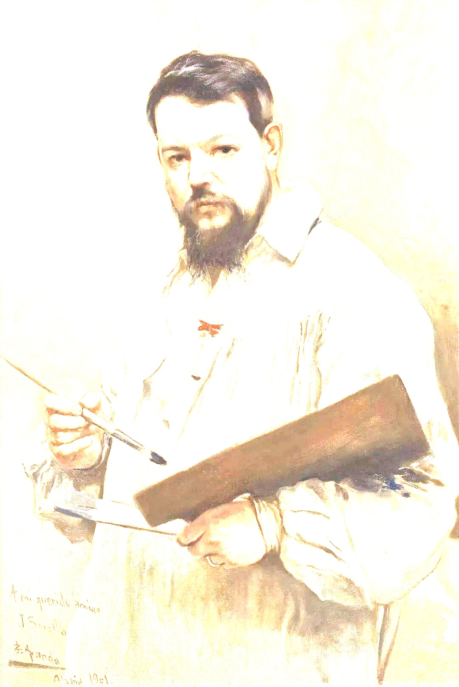
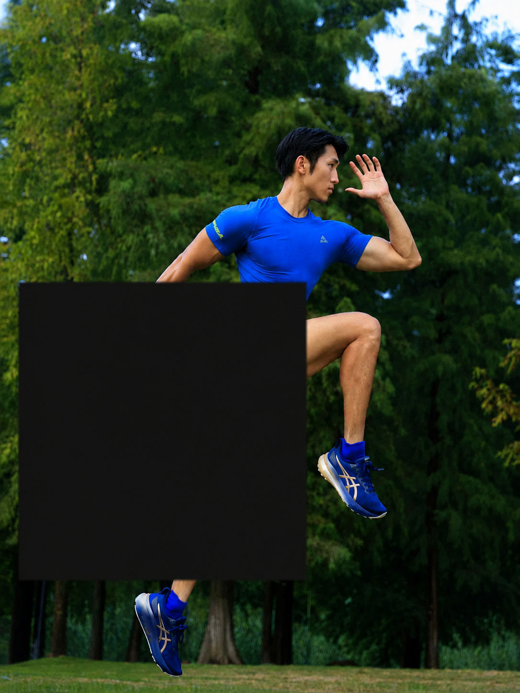

# 🚀 Modality Fault Lines: Structural Corruptions Reveal Fragile Omni-Modal Reasoning

**Paper:** Findings of EMNLP 2026 | **Dataset:** [Hugging Face](https://huggingface.co/datasets/KZL96/ModalityFaultLines-SCEval)

SCEval is a human-verified benchmark for studying the robustness of omni-modal models when text, visual input, and audio remain available but their internal evidence structure becomes unreliable. It focuses on structural corruption rather than missing-modality ablation: the task, answer options, and modality channels are held fixed while controlled corruptions are applied to text, vision, audio, or their combinations.

Rather than asking whether a model can answer with one modality removed, SCEval asks a more practical question: does its answer remain stable when a channel is still available but its words, visual details, or temporal signal can no longer be trusted in the usual way? The benchmark is designed to expose this gap between clean omni-modal accuracy and robustness to degraded cross-modal evidence.

## 🧭 Overview

Clean text--vision--audio evaluation cannot determine whether a model uses cross-modal evidence robustly or succeeds through cues that are sufficient only when all inputs are intact. SCEval addresses this gap through the notion of a **modality fault line**: a condition in which model behavior becomes unstable even though the relevant modality remains present and interpretable.

Each SCEval condition is paired with its clean counterpart at the example level. A corruption operator modifies the internal structure of one or more modality channels without replacing the question, answer space, or sample identity. This distinguishes SCEval from standard missing-modality settings, in which removing a channel changes the input regime itself.

SCEval supports analysis at two complementary levels. Single-modality conditions identify which kind of evidence a model is sensitive to, while bimodal and trimodal conditions show whether simultaneous corruption produces a simple accumulation of errors or a qualitatively different failure pattern.

## 🔍 What SCEval Tests

The central comparison is between a clean input and a structurally corrupted version of the same example. The modality channel and underlying scene remain present, but the evidence inside the channel becomes less reliable. SCEval tests whether a model preserves its answer under this intermediate form of degradation rather than after the modality is removed entirely. The examples below illustrate visual corruptions; the same principle is applied to text and audio, individually and jointly.

<table>
<thead>
<tr>
<th colspan="2">Case 1 · Overexposure</th>
<th colspan="2">Case 2 · Occlusion</th>
<th colspan="2">Case 3 · Defocus Blur</th>
</tr>
</thead>
<tbody>
<tr>
<td width="16.67%" align="center" valign="top"></td>
<td width="16.67%" align="center" valign="top"></td>
<td width="16.67%" align="center" valign="top"></td>
<td width="16.67%" align="center" valign="top"></td>
<td width="16.67%" align="center" valign="top"></td>
<td width="16.67%" align="center" valign="top"></td>
</tr>
<tr>
<td align="center"><strong>Clean</strong></td>
<td align="center"><strong>Corrupted</strong></td>
<td align="center"><strong>Clean</strong></td>
<td align="center"><strong>Corrupted</strong></td>
<td align="center"><strong>Clean</strong></td>
<td align="center"><strong>Corrupted</strong></td>
</tr>
</tbody>
</table>

## 📦 SCEval at a Glance

<table>
<tr>
<td width="42%" valign="top">

<table>
<thead>
<tr><th>Property</th><th>SCEval</th></tr>
</thead>
<tbody>
<tr><td><strong>Examples</strong></td><td>273 human-verified tri-modal examples</td></tr>
<tr><td><strong>Sources</strong></td><td>Social-IQ (100)<br>OmniBench (77)<br>VALOR (96)</td></tr>
<tr><td><strong>Modalities</strong></td><td>Text · Vision · Audio</td></tr>
<tr><td><strong>Task</strong></td><td>Multiple-choice question answering</td></tr>
<tr><td><strong>Evaluation</strong></td><td>Single · Dual · Tri-modal corruption</td></tr>
<tr><td><strong>Severity</strong></td><td>10 · 30 · 50 · 70</td></tr>
</tbody>
</table>

</td>
<td width="58%" valign="top" align="center">


</td>
</tr>
</table>

Each SCEval item pairs a clean tri-modal example with controlled corrupted variants while keeping the sample identity, question, answer options, and reference label unchanged. This enables paired clean-to-corrupted evaluation on the same underlying task. Human verification further distinguishes **gold-preserved** robustness cases from interpretable **stress-only** cases in which the original answer is no longer fully supported. Source media remains subject to the licenses of Social-IQ, OmniBench, and VALOR.

## 🧩 Corruption Design

SCEval contains fourteen structural corruption operators. They perturb the organization, completeness, ordering, or fidelity of evidence while retaining the modality channel itself.

| Modality | Operators |
| --- | --- |
| Text (4) | `typo_ocr`, `drop_words`, `word_shuffle`, `sentence_break` |
| Vision (7) | `noise`, `occlusion`, `low_resolution`, `motion_blur`, `defocus_blur`, `overexposure`, `brightness` |
| Audio (3) | `remove`, `mute`, `distortion` |

Every operator is evaluated at four severity levels: 10, 30, 50, and 70. SCEval includes single-modality conditions, paired corruptions across two modalities, and joint corruptions across text, vision, and audio. For stochastic operators, multiple variants are generated at the same severity to separate the effect of corruption strength from a particular random realization.

## ✅ Human Verification

SCEval uses human verification at both the base-example and corrupted-variant levels.

- **Base-example verification.** Candidate examples are screened for question validity, a defensible reference answer, and tri-modal answerability from the clean input.
- **Corrupted-input verification.** Audio and visual variants are checked for perceptual interpretability. Variants that become unusable media artifacts are excluded from the corresponding accuracy aggregate.
- **Answer-preservation audit.** For audited headline conditions, annotators answer the corrupted input before seeing the reference answer and then assess whether the original answer remains defensible. This separates **gold-preserved** variants from **stress-only** variants, where the input remains interpretable but no longer supports the original reference answer.

This procedure ensures that a reported corruption effect is not conflated with an invalid question, missing media, or an answer that has ceased to be supported by the corrupted input.

## 📏 What SCEval Measures

SCEval measures how model behavior changes when evidence remains available but becomes structurally unreliable. Its paired design supports clean-to-corrupted comparisons within the same underlying example and makes it possible to examine whether corruption in one modality interacts with corruption in another.

The benchmark is intended as a behavioral diagnostic. It identifies empirical robustness patterns under controlled structural corruption; it does not by itself establish the internal causal mechanism or representation-level source of a model's behavior.

## 📈 Robustness under Structural Corruption

In the paper, SCEval is evaluated on 15 omni-modal systems: seven proprietary/API models and eight open or open-API models. The results show that clean accuracy alone is not a reliable indicator of robustness under structurally degraded evidence.

<p align="center">
  
</p>

<p align="center"><em>Severity curves for six representative systems. Text, vision, and audio corruptions are shown with solid, dashed, and dotted lines; complete results for all 15 systems are reported in the paper.</em></p>

Corruption severity does not affect all operators equally. Word dropping, word shuffling, and visual noise produce the steepest declines, often accelerating beyond severity 30; audio removal and muting vary more across models, while distortion and appearance-level visual changes remain comparatively mild. This contrast suggests that fragility is driven less by generic perceptual degradation than by damage to evidence-bearing structure---lexical content and order, dense visual signal, or localized audio evidence. Models with different clean accuracies nevertheless share similar operator rankings, and their nonlinear decay indicates that performance can remain stable until sufficient structure is lost. Clean accuracy and corruption robustness should therefore be treated as distinct dimensions of omni-modal capability.

## 🔗 Availability

The SCEval dataset is available on the Hugging Face Hub:

<https://huggingface.co/datasets/KZL96/ModalityFaultLines-SCEval>

### Contents

```
data/
├─ dataset_baseline.jsonl          273 clean tri-modal questions (baseline reference)
├─ dataset_single.jsonl         29,144 single-modality corruptions
├─ dataset_combined.jsonl       17,875 bimodal + trimodal joint corruptions
└─ dataset_*_preview.json          first 30 rows of each file, indented
media/
├─ Social_IQ_single_question/    video + audio, 100 base examples
├─ omnibench/                    image + audio, 77 base examples
└─ valor/                        video + audio, 96 base examples
```

Each line of `data/*.jsonl` is one question and carries everything needed to evaluate it: question
text, answer options `A0`–`A3`, the reference key, the corruption metadata (`corruption_modality`,
`corruption_type`, `severity_base`, `severity_variant`), and direct URLs to the media. The media tree
mirrors `<source>/<sample_id>/<modality>/<operator>/<severity>/<variant>/<file>`. `sample_id` is what
ties a corrupted row back to its clean counterpart in the baseline split.

### Loading

Metadata only, media stays remote:

```python
from datasets import load_dataset

baseline = load_dataset("KZL96/ModalityFaultLines-SCEval", "baseline", split="train")
single   = load_dataset("KZL96/ModalityFaultLines-SCEval", "single",   split="train")

row = single[0]
print(row["question"], row["options"], row["gold_key"])
print(row["visual_url"], row["audio_url"])
```

Media is roughly 112 GB in total, so fetching a single source is usually enough to start:

```python
from huggingface_hub import snapshot_download

snapshot_download(
    repo_id="KZL96/ModalityFaultLines-SCEval",
    repo_type="dataset",
    allow_patterns=["media/omnibench/**"],   # drop this argument for the full tree
    local_dir="./SCEval",
)
```

### Reporting conventions

Two conventions are needed to reproduce the numbers in the paper. Corrupted rows are only
interpretable against their same-`sample_id` baseline row, so the baseline split should be evaluated
alongside any corruption split. And for stochastic operators, the multiple `severity_variant`
realizations within one (model, modality, operator, severity) bucket are aggregated **worst-case**:
if any variant is answered incorrectly, the bucket counts as incorrect.

## ⚠️ Limitations

SCEval contains 273 English tri-modal multiple-choice examples from three source benchmarks. Its operators model controlled structural degradation rather than semantic substitutions or adversarially optimized attacks. The benchmark is designed as a focused diagnostic setting, not as an exhaustive account of omni-modal robustness across languages, tasks, or real-world corruption processes.

## 📚 Citation
